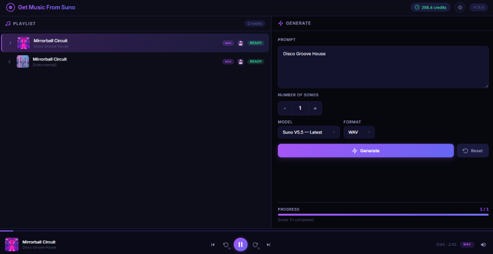
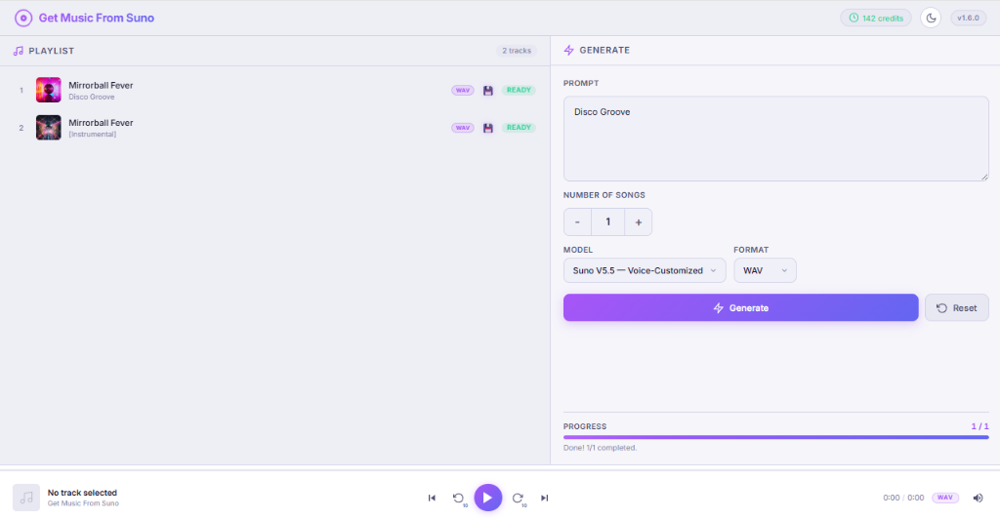

# 🎵 Get Music From Suno — AI Music Generator

[](https://github.com/kizer2m/GetMusicFromSuno)
[](LICENSE)
[](https://nodejs.org/)
[](https://sunoapi.org)

> **Generate AI music from text prompts using the Suno API.** A self-hosted web application with a premium dark/light UI, built-in playlist, WAV/MP3 download, and audio player. No frameworks — pure vanilla JavaScript.

---

## ✨ What Is This?

**Get Music From Suno** is an open-source, self-hosted web interface for the [Suno AI](https://suno.com) music generation API. Describe the music you want in plain text — the AI creates full songs with vocals, instrumentals, and lyrics in seconds.

**Use cases:**
- 🎶 Generate royalty-free background music for videos
- 🎙️ Create AI-generated songs for podcasts, YouTube, TikTok
- 🎧 Prototype music ideas with text descriptions
- 🎹 Batch-generate multiple song variations from one prompt

---

## 🚀 Key Features

| Feature | Description |
|---------|-------------|
| **Text-to-Music** | Describe any genre, mood, or style — AI creates full songs |
| **Suno V5.5 / V4.5 / V4 / V3.5** | Choose from multiple Suno AI model versions |
| **WAV + MP3 Download** | Lossless WAV or compressed MP3 — automatic conversion |
| **Built-in Audio Player** | Play, pause, skip, seek, rewind/forward 10s, volume control |
| **Batch Generation** | Generate 1–20 songs per prompt |
| **Auto-Save to Disk** | Tracks saved as `TrackName_V1.wav`, `TrackName_V2.wav` |
| **Dark / Light Theme** | Toggle with sun/moon icon, persists in browser |
| **Real-time Progress** | Live progress bar with status updates |
| **API Credit Balance** | Monitor remaining Suno API credits |
| **Cross-platform** | Windows (`start.bat`) + macOS/Linux (`start.sh`) |
| **No Build Step** | Pure vanilla HTML/CSS/JS — just `npm start` |

---

## 📸 Screenshots

<table>
  <tr>
    <td align="center"><strong>🌙 Dark Theme</strong></td>
    <td align="center"><strong>☀️ Light Theme</strong></td>
  </tr>
  <tr>
    <td></td>
    <td></td>
  </tr>
</table>

---

## 🛠️ Tech Stack

- **Backend:** Node.js + Express.js
- **Frontend:** Vanilla HTML / CSS / JavaScript (no frameworks)
- **API:** [Suno AI](https://suno.com) via [sunoapi.org](https://sunoapi.org)
- **Font:** Inter (Google Fonts)
- **Design:** CSS Custom Properties, dark/light theme, responsive layout

---

## 📦 Prerequisites

- **[Node.js](https://nodejs.org/)** v18 or higher (includes npm)
- **API Key** from [sunoapi.org](https://sunoapi.org)

---

## ⚡ Quick Start

```bash
# 1. Clone the repository
git clone https://github.com/kizer2m/GetMusicFromSuno.git
cd GetMusicFromSuno

# 2. Run the start script for your platform
```

| Platform | Command |
|----------|---------|
| **Windows** | Double-click `start.bat` |
| **macOS / Linux** | `chmod +x start.sh && ./start.sh` |

> **First run:** The script will automatically create a `.env` file and open it in an editor.  
> Paste your **Suno API key** (get one at [sunoapi.org](https://sunoapi.org)), save the file, and **re-run the script**.

The start scripts automatically:
- ✅ Verify Node.js and npm installation
- ✅ Create `.env` with a template on first launch
- ✅ Install missing dependencies
- ✅ Validate `.env` configuration
- ✅ Kill existing processes on port 3000
- ✅ Start server and open browser at `http://localhost:3000`

---

## ⚙️ Configuration

The `.env` file is **created automatically** when you run `start.bat` (Windows) or `start.sh` (Linux/macOS) for the first time.

If for some reason it was not created, create it **manually** in the project root with the following contents:

```env
SUNO_API_KEY=your_api_key_here
SUNO_API_BASE=https://api.sunoapi.org/api/v1
PORT=3000
```

Replace `your_api_key_here` with your actual API key from [sunoapi.org](https://sunoapi.org), then re-run the start script.

| Variable | Required | Default | Description |
|----------|----------|---------|-------------|
| `SUNO_API_KEY` | ✅ Yes | — | Your API key from [sunoapi.org](https://sunoapi.org) |
| `SUNO_API_BASE` | No | `https://api.sunoapi.org/api/v1` | API base URL |
| `PORT` | No | `3000` | Local server port |

---

## 🎮 Controls

| Element | Action |
|---------|--------|
| Prompt textarea | Describe the music you want |
| Song count (+/-) | Set how many songs to generate (1–20) |
| Model selector | Choose Suno model (V5.5, V4.5, V4, V3.5) |
| Format selector | Choose WAV (lossless) or MP3 |
| ⚡ Generate | Start AI music generation |
| 🔄 Reset | Clear prompt, playlist, and counters |
| Double-click track | Play selected track |
| ⏮ ⏪ ▶️ ⏩ ⏭ | Prev, -10s, Play/Pause, +10s, Next |
| Seek bar | Click or drag to jump to any position |
| 🔊 Volume | Mute/unmute toggle |
| ☀️ / 🌙 Theme | Switch between dark and light mode |

---

## 🔄 WAV Conversion Pipeline

```
Text Prompt → Suno API → MP3 (default)
                           ↓ (if WAV selected)
                     Wait for SUCCESS
                           ↓
                     POST /wav/generate (15s delay)
                           ↓
                     Poll /wav/record-info
                           ↓
                     WAV URL → Download & Save
```

- Automatic retry (3 attempts with exponential backoff)
- Fallback to MP3 if WAV conversion fails

---

## 📁 Project Structure

```
GetMusicFromSuno/
├── server.js          # Express backend, API proxy, styled console
├── public/
│   ├── index.html     # Single-page application
│   ├── style.css      # Design system (dark + light themes)
│   └── app.js         # Frontend logic (generation, player, playlist)
├── done/              # Auto-saved tracks (TrackName_V1.wav, etc.)
├── start.bat          # Windows start script
├── start.sh           # macOS/Linux start script
├── .env               # API key configuration (not committed)
├── package.json       # Dependencies and scripts
└── README.md          # This file
```

---

## 📋 Changelog

### v1.5.0
- 🌓 Dark/Light theme toggle with sun/moon icon
- Theme persists across sessions (localStorage)
- Dynamic version display from package.json
- Fixed version mismatch in UI
- Smooth CSS transitions on theme switch

### v1.4.0
- Versioned filenames: `TrackName_V1.wav`, `TrackName_V2.wav`
- Fixed WAV pipeline: correct polling (wait for full SUCCESS)
- Fixed infinite polling bug (variable scoping)
- Added retry logic for WAV conversion (3 attempts)
- Start scripts kill existing port 3000 process

### v1.3.0
- Fixed WAV conversion pipeline (correct API field mapping)
- Styled server console with ANSI colors and icons
- Start scripts now verify all dependencies

### v1.2.0
- WAV/MP3 format selector
- Dynamic format badges in player and playlist

---

## 🤝 Contributing

Contributions are welcome! Feel free to open issues or submit pull requests.

---

## 📄 License

MIT — free for personal and commercial use.

---

## 🔑 Keywords

`suno` `suno-api` `ai-music` `ai-music-generator` `music-generator` `text-to-music` `suno-ai` `music-creation` `ai-song-generator` `wav-converter` `mp3-download` `audio-player` `web-audio` `nodejs` `express` `vanilla-javascript` `self-hosted` `open-source` `dark-theme` `light-theme`
